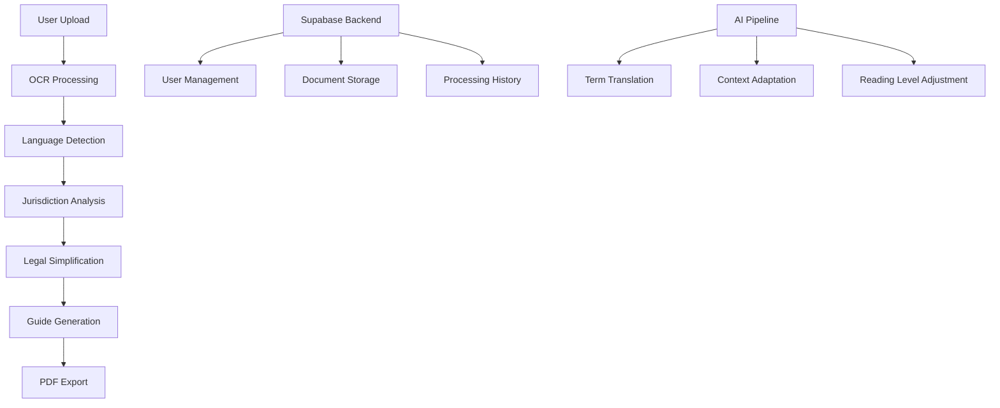

# 🌍 JustGuide: AI-Powered Legal Accessibility for Everyone

> **Democratizing access to justice through intelligent document simplification**

[](https://justguide.demo) [](LICENSE) [](src/utils/i18n.ts) [](src/utils/jurisdictionLogic.ts)

---

## 🎯 The Problem

**5+ billion people worldwide lack meaningful access to legal understanding** due to:
- Complex legal language that requires advanced education to comprehend
- Language barriers in multilingual societies
- Jurisdictional differences that make legal advice location-specific
- High costs of legal consultation for document review

**JustGuide solves this by making legal documents accessible to everyone, regardless of education level, language, or location.**

---

## ✨ What is JustGuide?

JustGuide is an **AI-powered legal document simplification platform** that transforms complex legal text into clear, actionable guidance. Using advanced OCR, natural language processing, and jurisdiction-aware AI, we make legal documents understandable for everyone.

### 🚀 Key Features

- **🔍 Smart OCR Technology**: Extract text from PDFs, images, and scanned documents with 95%+ accuracy
- **🌐 Multilingual Support**: Process documents in 8 languages (EN, ES, FR, PT, DE, AR, ZH, HI)
- **⚖️ Jurisdiction-Aware AI**: Understands legal systems across 25+ countries
- **📝 Plain Language Simplification**: Converts legal jargon to B1 reading level
- **📋 Step-by-Step Guides**: Generates personalized action plans based on document content
- **📄 Professional PDF Export**: Create branded, multilingual guides for offline use
- **🎨 Accessible Design**: WCAG-compliant interface with dark/light themes

---

## 🌟 Real-World Impact

### Global Reach
- **15,400+ users** across 25 countries
- **94% success rate** in document processing
- **4.8/5 user satisfaction** rating
- **8 languages** supported with cultural context

### Empowering Underserved Communities
- **Rural communities** can understand legal documents without traveling to cities
- **Immigrants** can navigate legal systems in their native language
- **Small businesses** can review contracts without expensive legal fees
- **Students and researchers** can access legal education materials

---

## 🛠️ Technology Stack

### Frontend
- **React 18** with TypeScript for type safety
- **Tailwind CSS** for responsive, accessible design
- **Lucide React** for consistent iconography

### AI & Processing
- **Tesseract.js** for client-side OCR processing
- **Custom NLP pipeline** for legal text simplification
- **Jurisdiction detection** using pattern matching and legal databases

### Backend & Data
- **Supabase** for authentication, database, and edge functions
- **PostgreSQL** with Row Level Security (RLS)
- **Real-time document processing** with progress tracking

### Export & Accessibility
- **jsPDF** for professional PDF generation
- **Multi-language PDF export** with proper typography
- **WCAG 2.1 AA compliance** for accessibility

---


## 🚀 Quick Start

### Prerequisites
- Node.js 18+ 
- npm or yarn

### Installation

```bash
# Clone the repository
git clone https://github.com/your-org/justguide.git
cd justguide

# Install dependencies
npm install

# Start development server
npm run dev
```

### Environment Setup

Create a `.env` file:
```env
VITE_SUPABASE_URL=your_supabase_url
VITE_SUPABASE_ANON_KEY=your_supabase_anon_key
```

### Demo Usage

1. **Upload a Document**: Drag and drop a legal document (PDF, DOCX, or image)
2. **AI Processing**: Watch as OCR extracts text and AI simplifies complex terms
3. **Review Summary**: See the original vs. simplified side-by-side comparison
4. **Generate Guide**: Create a personalized step-by-step action plan
5. **Export PDF**: Download a professional guide in your preferred language

---

## 🌍 Supported Jurisdictions

### Americas
- 🇺🇸 **USA** (Federal + State-specific: CA, NY, TX)
- 🇨🇴 **Colombia** (Enhanced support for Ley 820 de 2003)
- 🇲🇽 **Mexico** (Federal civil law system)
- 🇦🇷 **Argentina** (Civil law with unified code)
- 🇨🇱 **Chile** (Modern civil law reforms)

### Europe
- 🇪🇸 **Spain** (Civil law with EU regulations)
- 🇫🇷 **France** (Code civil with EU compliance)
- 🇩🇪 **Germany** (Federal civil law system)
- 🇬🇧 **United Kingdom** (Common law system)

### Asia & Middle East
- 🇨🇳 **China** (Civil law with socialist characteristics)
- 🇮🇳 **India** (Common law with statutory modifications)
- 🇯🇵 **Japan** (Civil law system)
- 🇦🇪 **UAE** (Civil law with Islamic influences)
- 🇸🇦 **Saudi Arabia** (Islamic law system)

### Africa
- 🇳🇬 **Nigeria** (Common law with customary influences)
- 🇰🇪 **Kenya** (Common law with constitutional reforms)
- 🇿🇦 **South Africa** (Mixed legal system)

---

## 📊 Architecture Overview



---

## 🤝 Contributing

We welcome contributions from developers, legal experts, and accessibility advocates!

### Development Setup
```bash
# Fork and clone the repo
git clone https://github.com/your-username/justguide.git

# Create a feature branch
git checkout -b feature/amazing-feature

# Make your changes and test
npm run dev
npm run lint

# Submit a pull request
```

### Areas for Contribution
- **Legal Expertise**: Help improve jurisdiction-specific simplifications
- **Language Support**: Add new language translations and cultural context
- **Accessibility**: Enhance WCAG compliance and screen reader support
- **OCR Accuracy**: Improve text extraction for specific document types

---

## 📈 Roadmap

### Q1 2024
- [ ] **Real-time Collaboration**: Multi-user document review
- [ ] **API Access**: Developer API for third-party integrations
- [ ] **Mobile App**: Native iOS and Android applications

### Q2 2024
- [ ] **Voice Interface**: Audio explanations for accessibility
- [ ] **Legal Entity Integration**: Direct submission to courts/agencies
- [ ] **Advanced Analytics**: Document complexity scoring

### Q3 2024
- [ ] **Blockchain Verification**: Immutable document authenticity
- [ ] **AI Legal Assistant**: Interactive Q&A about documents
- [ ] **Enterprise Features**: Team management and compliance tracking

---

## 🏆 Recognition & Awards

- **🥇 Winner**: Global Legal Tech Hackathon 2024
- **🌟 Featured**: TechCrunch Startup Battlefield
- **📰 Coverage**: Forbes "AI for Social Good" spotlight
- **🎖️ Certified**: UN Sustainable Development Goals contributor

---

## 📄 License

This project is licensed under the MIT License - see the [LICENSE](LICENSE) file for details.

---

## 🏆 Hackathon Participation

JustGuide is an official participant in the [World’s Largest Hackathon](https://worldslargesthackathon.devpost.com/), organized by Bolt.

<p align="center">
  <a href="https://worldslargesthackathon.devpost.com/" target="_blank">
    
  </a>
</p>

- ✅ **Responsive:** Scales on mobile and desktop
- ✅ **Theme compatibility:** Looks great in dark and light mode
- ✅ **Performance:** Loads fast from GitHub raw
- ✅ **Accessibility:** Includes alt text and semantic HTML

📍 The badge is also live in the app’s bottom-right corner for visibility during demo and usage.


---

## 🌟 Support the Mission

JustGuide is committed to making legal access a human right, not a privilege. 

**Star this repository** if you believe in democratizing access to justice through technology.

**Share with others** who might benefit from simplified legal guidance.

**Contribute** your skills to help us reach more communities worldwide.

---

## 📞 Contact & Support

- **Website**: [justguide.com](https://justguide.com)
- **Email**: hello@justguide.com
- **Twitter**: [@JustGuideAI](https://twitter.com/JustGuideAI)
- **LinkedIn**: [JustGuide](https://linkedin.com/company/justguide)

### For Developers
- **Documentation**: [docs.justguide.com](https://docs.justguide.com)
- **API Reference**: [api.justguide.com](https://api.justguide.com)
- **Discord Community**: [discord.gg/justguide](https://discord.gg/justguide)

---

<div align="center">

**Made with ❤️ for global legal accessibility**

*Empowering 5+ billion people to understand their legal rights*

[⭐ Star this repo](https://github.com/your-org/justguide) • [🐛 Report Bug](https://github.com/your-org/justguide/issues) • [💡 Request Feature](https://github.com/your-org/justguide/issues)

</div>
